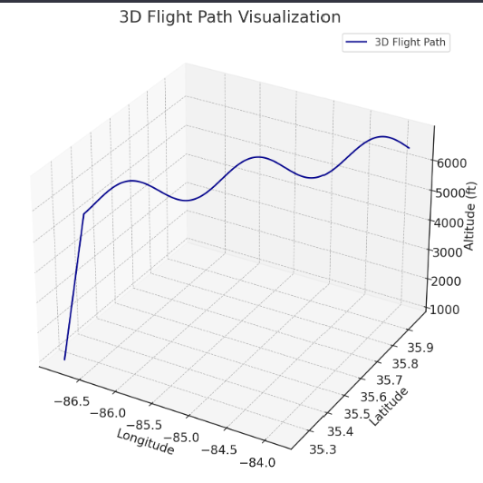
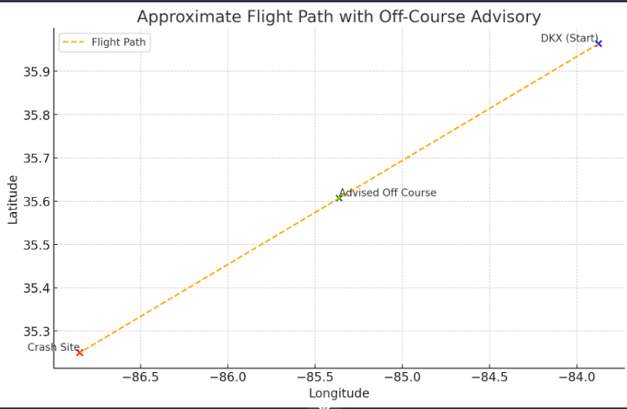
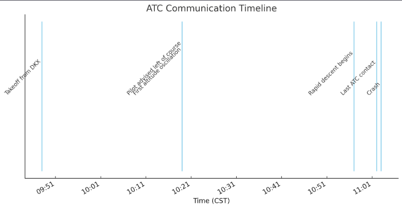
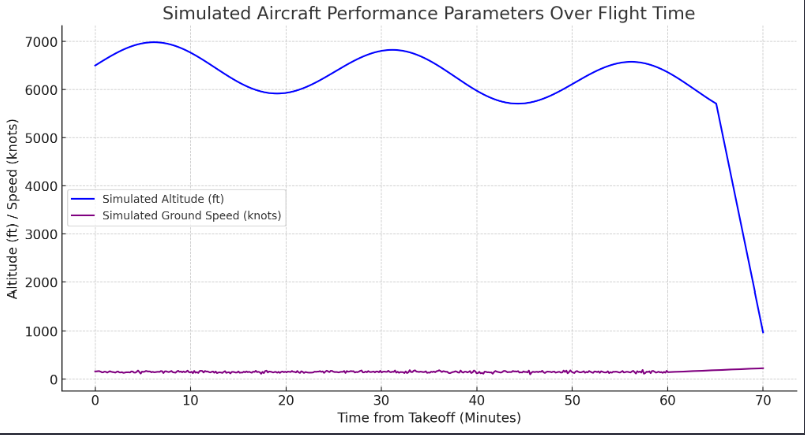
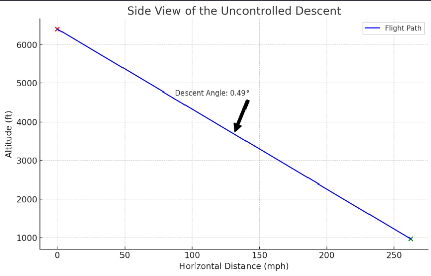
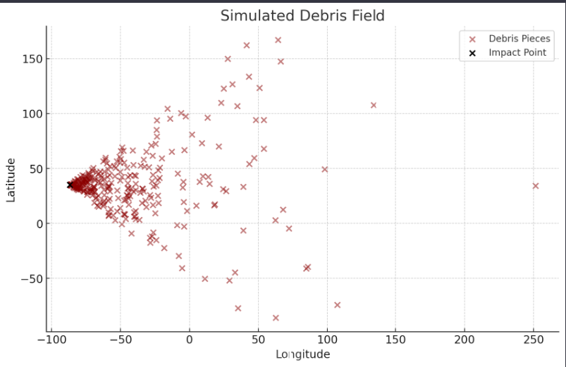
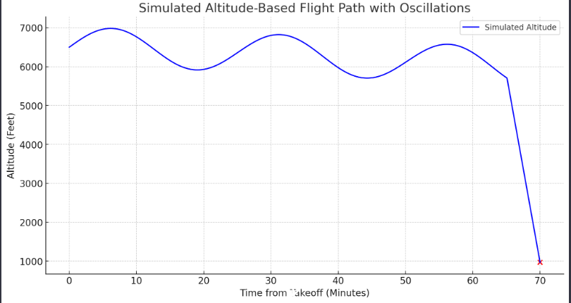

##PROJECT TRANSPARENCY NOTE:
- This project demonstrates rapid knowledge acquisition in a complex domain, transforming raw data into clear, actionable insights. This analysis focused on aviation safety, but these skills—data extraction, manipulation, visualization, and critical thinking—apply broadly to promote data-driven decision-making across industries.

_**(Sensitivity Disclaimer)**_

# TNYFlyGirl-Data-Analysis
A python visual data analysis and representation of TNYFlyGirls fatal plane crash.
# Flight Analysis Visualizations

This repository contains a series of visualizations representing various aspects of flight analysis, particularly focusing on factors leading to aviation accidents. Below are the descriptions and visuals for each aspect analyzed. This data has been extracted and analyzed with the Aviation Investigation Preliminary Report (ERA24FA058). It appears the main causes range from SOP negligence, passenger interference, navigational oversight, improper ATC communication, and poor mental conditioning.

## 3D Visualization:
This illustrates the 3D trajectory of the flight from the departure point at Knoxville Downtown Island Airport (DKX) to the vicinity of the crash site.
X-Axis (Longitude), Y-Axis (Latitude), and Z-Axis (Altitude): Together provide a comprehensive view of the aircraft's movement over time in three-dimensional space.

## Flight Path Analysis with Advisories of Being Off Path:
We can plot the flight path starting from Knoxville Downtown Island Airport (DKX) to the crash site near Pulaski, TN.
We'll mark the point where the pilot was advised that she was left of course and her subsequent correction.

## ATC Communication Timeline:
This visualization can include the timeline of key communications between the pilot and ATC.
It highlights the moments when the pilot was instructed to contact the Memphis Air Route Traffic Control Center and any relevant communications during the flight's final moments.

## Aircraft Performance Parameters:
We can plot a graph showing the altitude variations and corresponding ground speed fluctuations as mentioned in the report.
This graph illustrates the altitude oscillations between about 6,400 ft and 5,300 ft, as well as the speed variations up to the maximum of 228 knots.

## Side View of the Uncontrolled Descent
This visual shows the steep descent angle of the aircraft, from its initial altitude to the point of impact.

## Simulated Debris Field
The dark red dots indicate the scattered pieces of debris, spread in a fan-like pattern from the point of impact. The black dot marks the impact point of the crash.

## Simulated Altitude-Based Flight Path with Oscillations
This graph depicts the fluctuating altitude pattern of the aircraft over time, culminating in a sharp descent.

## Common Fatal Mistakes Made by Pilot Ranked by Severity
This bar chart ranks the most fatal mistakes made by the pilot in question, according to their severity.

# Main Fatal Errors:
#### 1. Pilot Disorientation and Confusion
#### 2. Inappropriate Passenger Interference
#### 3. Neglect of Standard Operating Procedures
#### 4. Failure to Respond to Air Traffic Control (ATC) Instructions
#### 5. Erratic Flight Path with Altitude Oscillations
#### 6. Rapid and Uncontrolled Descent Leading to Crash
