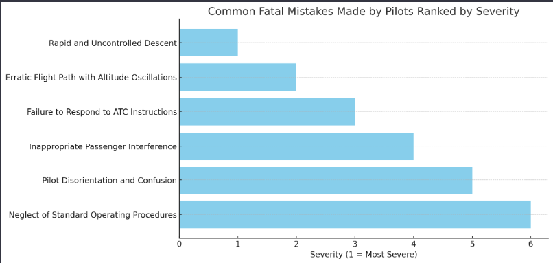

# TNYFlyGirl-Data-Analysis
A python visual data analysis and representation of TNYFlyGirls fatal plane crash.
# Flight Analysis Visualizations

This repository contains a series of visualizations representing various aspects of flight analysis, particularly focusing on factors leading to aviation accidents. Below are the descriptions and visuals for each aspect analyzed. This data has been extracted and analyzed with the Aviation Investigation Preliminary Report (ERA24FA058).

## 1. Side View of the Uncontrolled Descent
This visual shows the steep descent angle of the aircraft, from its initial altitude to the point of impact.

## 2. Simulated Debris Field
The dark red dots indicate the scattered pieces of debris, spread in a fan-like pattern from the point of impact. The black dot marks the impact point of the crash.

## 3. Simulated Altitude-Based Flight Path with Oscillations
This graph depicts the fluctuating altitude pattern of the aircraft over time, culminating in a sharp descent.

## 4. Common Fatal Mistakes Made by Pilot Ranked by Severity
This bar chart ranks common fatal mistakes made by the pilot according to their severity.

